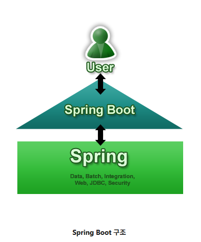

## 어노테이션(Annotation)
- 어노테이션을 붙임으로써 스트링 내부에서 자동으로 Bean Factory에서 처리        

## @Controller, @GetMapping
- @Controller : 컨트롤러 만드는 어노테이션 (클래스)
- @GetMapping : 이름 매핑 (메소드)
- 같은 이름으로 여러개 매핑 X

## 스프링 라이브러리
- Spring 프레임워크 구조 이미지

https://start.spring.io/

## 빌드&배포
- Tomcat 서버오 jar를 이용하여 단독으로 실행
- 실행 버튼 -> 구성편집 -> gradle에서 bootRun과 build추가
적용 후에 build로 설정 후 실행
-> build.libs 경로에 jar파일 생성됨
- cmder에서 코드 입력
(java -jar study-0.0.1-SNAPSHOT.jar)
jar 파일을 이용 **aws에 저장

Springboot 프로젝트 생성 -----> 코드 작업 및 완성 -----> 빌드(실행환경 포함 압축파일 생성): ~.jar -----> 배포 : 호스팅 서버에 저장

## react와 연동
1. settings.gradle 코드추가
include 'frontend'
include 'backend'
2. app폴더에 backend 폴더 추가
3. 만들어진 backend 폴더에 src폴더 잘라넣기
4. bulid.gradle backend 폴더에 복사
5. build.gradle(app 폴더)코드 추가
// 루트 프로젝트 자체는 빌드 아티팩트(jar)를 만들지 않습니다.
bootJar.enabled = false
jar.enabled = false

// 하위 프로젝트 공통 설정
subprojects {
    repositories {
        mavenCentral()
    }

    // Spring Boot 관련 의존성 관리 및 플러그인은 backend 모듈에서만 적용되도록 설정할 수 있습니다.
    // 하지만, 공통적인 의존성 버전 관리를 위해 여기서 dependency-management만 적용하는 것도 가능합니다.
    apply plugin: 'io.spring.dependency-management'

    // 공통적으로 사용되는 설정이 있다면 여기에 추가합니다.
}
6. 그래들 동기화

## cmder로 실행
react는 frontend 폴더까지 들어가서 
- npm start
backend는 app폴더에서
- gradlew backend:bootRun

## github branch 변경
git checkout 브랜치명