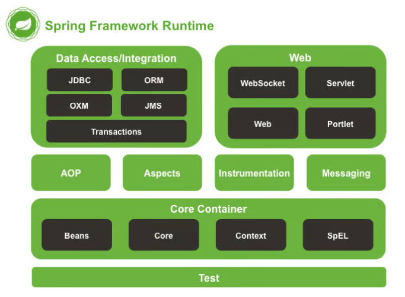
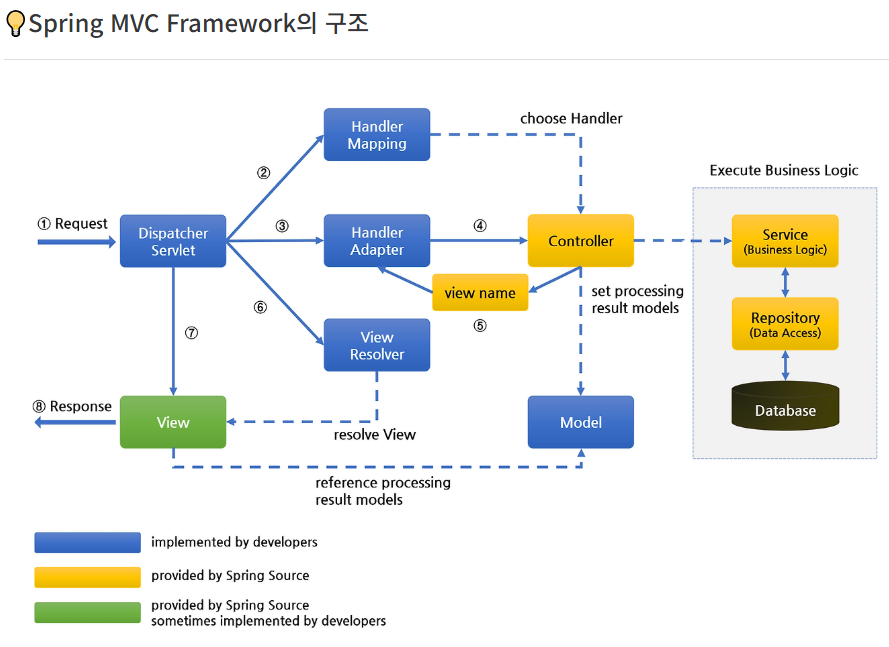

## 어노테이션(Annotation)
- 어노테이션을 붙임으로써 스트링 내부에서 자동으로 Bean Factory에서 처리        

## @Controller, @GetMapping
- @Controller : 컨트롤러 만드는 어노테이션 (클래스)
- @GetMapping : 이름 매핑 (메소드)
- 같은 이름으로 여러개 매핑 X

## 스프링 라이브러리
- Spring 프레임워크 구조 이미지

https://start.spring.io/

## 빌드&배포
- Tomcat 서버오 jar를 이용하여 단독으로 실행
- 배포-java -jar study-0.0.1-SNAPSHOT.jar
            jar 파일을 이용 **aws에 저장

Springboot 프로젝트 생성 -----> 코드 작업 및 완성 -----> 빌드(실행환경 포함 압축파일 생성): ~.jar -----> 배포 : 호스팅 서버에 저장